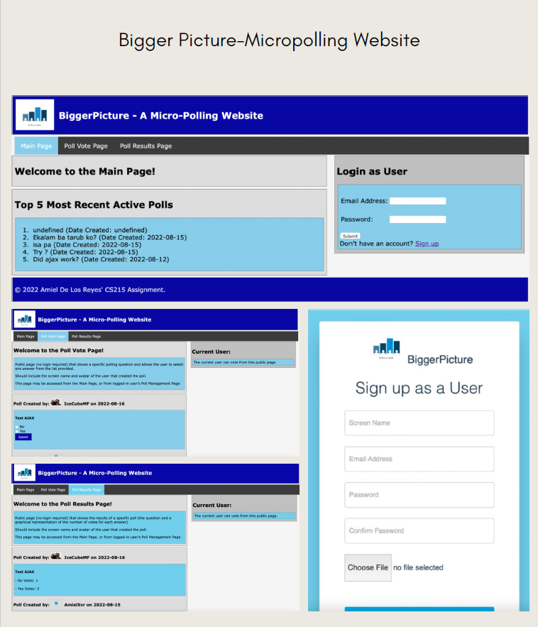

# Micropolling WebApp

Welcome to the Micropolling WebApp repository! This project is a web application designed for conducting micropolls, developed as part of a university project.

## Tech Stack

- **PHP CodeIgniter:** A robust PHP framework for building dynamic web applications.
- **HTML5/CSS3:** Ensuring a modern and responsive user interface.
- **Bootstrap:** Enhancing the overall design and user experience.
- **MariaDB, MySQL:** Reliable database management systems for efficient data storage.
- **AJAX/JSON:** Facilitating seamless data exchange and enhanced user interactions.

## Features

- **Micropoll Creation:** Easily create micropolls for collecting quick opinions and feedback.
- **User-Friendly Interface:** Intuitive design for a seamless user experience.
- **Database Management:** Efficiently stores and manages micropoll data using MariaDB and MySQL.
- **Responsive Design:** Ensures accessibility and functionality across various devices.

## Project Images:

Feel free to explore the codebase and contribute to the continuous improvement of our Micropolling WebApp. Together, we are creating an interactive and efficient platform for conducting micropolls.
